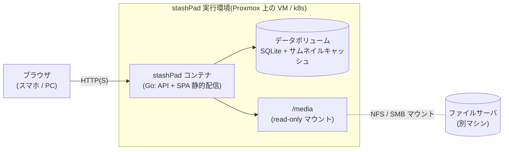
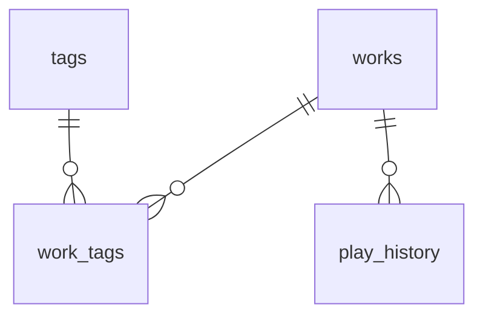
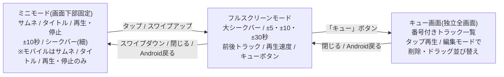

# stashPad 設計ドキュメント

自宅ファイルサーバ上のメディアデータ(音声・動画・画像/マンガ)を、PC・スマホのブラウザから検索・閲覧・再生できるセルフホスト型メディアライブラリ。

- ステータス: ドラフト(第2版 — 初回レビュー反映済み)
- 最終更新: 2026-06-12

---

## 1. 背景と目的

DLsite 等で購入したメディアデータがファイルサーバに保管されているが、視聴のたびに PC やスマホへ手動コピーしており不便。これをブラウザから直接ストリーミング視聴できるようにする。

### 解決したいこと

1. **ブラウザからの視聴** — スマホをメイン、PC をサブとする。音声(マスト)、動画、画像に対応。
2. **タグベースの検索** — DLsite から抽出した作品情報 CSV をインポートして検索に活用。加えて独自タグも付与可能にする。
3. **作品側のフォルダ構造に依存しない** — 作品フォルダの中身を整理し直すことなく、ライブラリ側がエクスプローラ的にフォルダ内をブラウズできる。

### 基本的な利用フロー


---

## 2. 要件

### 2.1 機能要件

| # | 要件 | 優先度 |
|---|------|--------|
| F1 | 作品一覧表示(サムネイル付きカード) | MUST |
| F2 | キーワード検索(タイトル・サークル・RJ番号) | MUST |
| F3 | タグによる絞り込み(AND 条件、カテゴリ別ファセット) | MUST |
| F4 | DLsite 作品情報 CSV のインポート | MUST |
| F5 | 独自タグの追加・削除 | MUST |
| F6 | 作品フォルダ内のディレクトリブラウズ | MUST |
| F7 | 音声再生(連続再生・シーク・N秒送り/戻し・再生速度変更) | MUST |
| F8 | 再生履歴の記録・閲覧 | SHOULD(MUST 寄り) |
| F9 | 画像閲覧(マンガビューア: ページ送り・プリロード) | SHOULD |
| F10 | 動画再生(mp4) | SHOULD |
| F11 | ライブラリの自動スキャン(フォルダ → 作品の登録) | MUST |
| F12 | お気に入り | LATER |
| F13 | 評価 | LATER(独自タグで運用代替可能) |
| F14 | 簡易認証 | LATER(後付け可能な構造にはしておく) |
| F15 | 再生位置の記憶(続きから再生) | LATER |

zip 等アーカイブの無展開閲覧は**スコープ外**(全作品展開済みのため)。

### 2.2 非機能要件

- **デプロイが簡単**: コンテナで動くこと。実行環境は自宅 Proxmox。既存の k8s クラスタに載せる想定だが、マイクロサービス化等は意識せず「compose 相当のものが k8s にあるだけ」のレベル感。
- **メディアは読み取り専用**: ライブラリはファイルサーバ上の作品フォルダを一切変更しない。DB・サムネイルキャッシュは別領域に持つ。
- **規模感**: 作品数 1,500〜。当面 1 万には届かない想定。
- **シングルユーザー**: 自宅ホストでの個人利用。マルチテナントは考えない。
- **モバイルファースト**: スマホがメインクライアント。UI はスマホ基準で設計し、PC はその拡張。
- **ネットワーク**: サーバは 1Gbps 有線、スマホは 11ac 2x2(実効 ~400Mbps)。FLAC/WAV のストリーミングでも帯域は問題にならない(後述 §7)。

### 2.3 スコープ外

- **トランスコード** — 対応必須フォーマット(flac / wav / mp3 / mp4 / webp / png / jpg)はすべてブラウザネイティブ再生可能なため不要(§7)。動画も mp4 しか存在しない。
- zip/rar アーカイブの無展開閲覧。
- DLsite からの情報自動取得(CSV で代替)。
- 複数ユーザー・権限管理。

---

## 3. アーキテクチャ

### 3.1 全体構成



- メディアの実体は**別マシンのファイルサーバ**上。実行環境側で NFS/SMB マウントし、コンテナへ **read-only** で渡す。
- メタデータ(作品・タグ・履歴)は SQLite。サムネイルキャッシュもデータボリューム側に生成。
- フロントエンドはビルド済み静的ファイルを Go バイナリに `embed` して同一ポートで配信(単一コンテナ・単一ポート)。

### 3.2 技術スタック

| レイヤ | 技術 | 選定理由 |
|--------|------|----------|
| バックエンド | **Go 1.25+**(net/http + chi) | `http.ServeContent` が Range/206 を標準でサポートしストリーミング配信に最適。単一静的バイナリでコンテナ/k8s と相性が良い。本アプリの実態は「ファイル配信 + SQLite CRUD」であり Go の得意領域 |
| DB | SQLite(modernc.org/sqlite, pure Go) | cgo 不要でクロスビルド容易。単一ファイルでバックアップ楽。想定規模(数千作品)に十分 |
| サムネイル | golang.org/x/image + 標準 image | jpg/png/webp のデコード・縮小に対応(キャッシュ出力は jpeg) |
| フロントエンド | React + TypeScript + Vite | SPA でプレイヤー/ビューアの状態管理がしやすい(ブラウズ中の再生継続) |
| デプロイ | コンテナ(Docker Compose / k8s マニフェスト両方提供) | 単一 Deployment + Service + PVC 程度のシンプル構成 |

**Python(FastAPI)案からの変更について**: 当初案の Python 優位点はメディア系ライブラリ(mutagen / Pillow)だったが、本設計ではフォルダ内容を DB に取り込まず音声メタデータ解析も必須でないため、その優位性はほぼ効かない。配信・単一バイナリ・k8s 適性では Go が上回るため Go を採用。

### 3.3 リポジトリ構成(予定)

```
stashPad/
├── backend/
│   ├── cmd/stashpad/main.go
│   ├── internal/
│   │   ├── api/          # HTTP ハンドラ(works, tags, files, history, import, scan)
│   │   ├── config/       # 環境変数読み込み
│   │   ├── db/           # マイグレーション・クエリ
│   │   ├── scanner/      # ライブラリスキャン
│   │   ├── csvimport/    # CSV インポータ
│   │   ├── thumb/        # サムネイル生成
│   │   └── media/        # パス検証・Range 配信・自然順ソート
│   └── go.mod
├── frontend/
│   └── src/
│       ├── pages/        # 一覧 / 作品詳細 / 履歴 / 設定
│       ├── components/   # ファイルブラウザ / プレイヤー / ビューア
│       └── api/          # API クライアント
├── deploy/
│   ├── docker-compose.yml
│   └── k8s/              # Deployment / Service / PVC
├── docs/
│   ├── design.md
│   └── samples/
└── README.md
```

---

## 4. データモデル

### 4.1 ER 図



### 4.2 テーブル定義

**works** — 作品。原則「ライブラリルート直下の 1 フォルダ = 1 作品」。

| カラム | 型 | 説明 |
|--------|----|------|
| id | INTEGER PK | |
| rj_number | TEXT UNIQUE NULL | `RJ404669` 等。フォルダ名先頭から抽出 |
| title | TEXT | CSV があれば CSV のタイトル、なければフォルダ名由来 |
| circle | TEXT NULL | サークル名 |
| series_name | TEXT NULL | シリーズ名 |
| purchase_date | TEXT NULL | 購入日時 |
| work_type | TEXT NULL | ボイス・ASMR / 動画 / マンガ 等 |
| age_rating | TEXT NULL | 全年齢 / R-15 / R-18 |
| file_format | TEXT NULL | CSV 由来の参考情報 |
| file_size_text | TEXT NULL | CSV 由来の参考情報("4.91GB" 等そのまま) |
| event | TEXT NULL | CSV 由来 |
| root_path | TEXT NULL | 作品フォルダの絶対パス(複数ライブラリルートに対応するため。implementation-notes.md §3 参照)。NULL = CSV のみでフォルダ未発見 |
| thumbnail_path | TEXT NULL | サムネイルキャッシュへのパス |
| created_at / updated_at | TEXT | |

- `root_path` が NULL の作品(CSV にあるがフォルダ未スキャン)は一覧で「未取込」表示。後からフォルダが見つかれば RJ 番号で自動リンク。
- 逆にフォルダはあるが CSV に無い作品は、フォルダ名をタイトルとして登録され、後から CSV インポートでメタデータが補完される。

**tags** — タグ。カテゴリで出自を区別する。UNIQUE(name, category)。

| カラム | 型 |
|--------|----|
| id | INTEGER PK |
| name | TEXT |
| category | TEXT |

**work_tags** — 中間テーブル。`(work_id, tag_id)` PK。

**play_history** — 再生履歴。再生開始時に 1 行記録する。

| カラム | 型 | 説明 |
|--------|----|------|
| id | INTEGER PK | |
| work_id | INTEGER FK | |
| file_path | TEXT | 作品ルートからの相対パス(何のファイルを再生したか) |
| played_at | TEXT | 再生開始日時 |

履歴画面では作品単位でグルーピングして「最近再生した作品」を表示する。生データは消さずに残す(再生回数等の集計にも使える)。

### 4.3 タグ展開の具体例(RJ404669)

CSV のこの行:

```
RJ404669,耳舐め&耳ふ～サンドイッチ ダウナー妹と低音姉【R-15癒し/CV:箱河ノアさま・耳恋なかさま】,
ぐっすり眠れるASMR,チームランドセル,2026/01/04 10:44,"R-15, ボイス・ASMR",
ASMR 癒し 淡白/あっさり バイノーラル/ダミヘ 耳かき ラブラブ/あまあま ささやき 耳舐め,
ボイス・ASMR,WAV/ MP3同梱,4.91GB,,R-15,,カマキリ,葉月かなめ,耳恋なか/箱河ノア,
```

は、以下のように分解される。

**works テーブルへ(1 行):**

| カラム | 値 |
|--------|----|
| rj_number | RJ404669 |
| title | 耳舐め&耳ふ～サンドイッチ ダウナー妹と低音姉【R-15癒し/CV:箱河ノアさま・耳恋なかさま】 |
| series_name | ぐっすり眠れるASMR |
| circle | チームランドセル |
| purchase_date | 2026/01/04 10:44 |
| work_type | ボイス・ASMR |
| file_format | WAV/ MP3同梱 |
| file_size_text | 4.91GB |
| age_rating | R-15 |

**tags / work_tags へ(計 14 タグが紐づく):**

| category | name | 由来カラムと区切り |
|----------|------|--------------------|
| genre | R-15 | genres(`,` 区切り) |
| genre | ボイス・ASMR | genres |
| detail_genre | ASMR | detail_genres(空白区切り) |
| detail_genre | 癒し | detail_genres |
| detail_genre | 淡白/あっさり | detail_genres ※タグ名自体に `/` を含む |
| detail_genre | バイノーラル/ダミヘ | detail_genres |
| detail_genre | 耳かき | detail_genres |
| detail_genre | ラブラブ/あまあま | detail_genres |
| detail_genre | ささやき | detail_genres |
| detail_genre | 耳舐め | detail_genres |
| scenario | カマキリ | scenario(`/` 区切り) |
| illustration | 葉月かなめ | illustration |
| voice_actor | 耳恋なか | voice_actor(`/` 区切りで 2 つに分割) |
| voice_actor | 箱河ノア | voice_actor |

タグはライブラリ全体で共有される。例えば「カマキリ」(scenario) は RJ304928・RJ237618 にも同じタグ ID で紐づくので、タグをタップすれば同シナリオ作品が横断検索できる。

ユーザーが UI から追加する独自タグは category=`custom` として同じ仕組みに乗る(例: 「お気に入り」「睡眠用」など)。**CSV 再インポート時は CSV 由来カテゴリのタグだけを張り直し、custom には触れない**。

### 4.4 CSV カラムのマッピング(まとめ)

| CSV カラム | 行き先 | 区切り |
|-----------|--------|--------|
| rj_number, title, series_name, circle, purchase_date, work_type, file_format, file_size, age_rating, event | works の各カラム | — |
| genres | tags (genre) | `,` |
| detail_genres | tags (detail_genre) | 空白 |
| voice_actor / scenario / illustration / music | tags (各カテゴリ) | `/` |
| supported_os | 取り込まない | — |

インポートは **rj_number をキーに upsert**(再インポートで重複しない)。

---

## 5. ライブラリスキャン

### 5.1 フォルダ命名の前提

作品フォルダは必ず以下の形式で格納されている:

```
RJ404669_耳舐め&耳ふ～サンドイッチ ダウナー妹と低音姉【R-15癒し／CV：箱河ノアさま・耳恋なかさま】
└── (フォルダ構造は作品ごとに不定)
```

- 先頭が `RJ番号 + _`、続いて作品名。
- 作品名部分はファイルシステム禁止文字が置換されている(例: `/`→`／`, `:`→`：`)ため、**CSV のタイトルとは一致しない場合がある。突合は必ず RJ 番号で行う**。

### 5.2 作品の検出

1. 設定された**ライブラリルート(複数指定可)**の直下ディレクトリを列挙する。
2. ディレクトリ名から `^RJ\d{6,8}` を抽出 → 既存作品(CSV 取込済含む)と突合し、`root_path` をリンク。
3. RJ 番号が取れないフォルダも、フォルダ名をタイトルとして作品登録する(後で手動編集 / CSV 補完可能)。
4. サムネイル候補を探す: フォルダ直下(→ 浅い階層)の画像のうち、ファイル名に `表紙|cover|jacket|サムネ|main` を含むものを優先、なければ最初の画像。縮小して jpeg でキャッシュ。

ポイント: **スキャンが見るのはトップディレクトリの対応付けとサムネイルだけ**。フォルダ内部の全ファイルを DB に取り込むことはしない(フォルダ内容はブラウズ時にリアルタイムで読む)。これにより、ファイル構成が変わっても再スキャン不要で、DB が肥大化しない。

### 5.3 トリガー

- 手動: 設定画面の「スキャン」ボタン / `POST /api/scan`
- 起動時: オプションで自動実行
- 定期実行・フォルダ監視は LATER

---

## 6. API 設計

ベースパス `/api`。

### 作品

| Method | Path | 説明 |
|--------|------|------|
| GET | `/works` | 一覧 + 検索。`?q=キーワード&tags=1,2,3&sort=purchase_date&page=` |
| GET | `/works/{id}` | 詳細(メタデータ + 全タグ) |
| PATCH | `/works/{id}` | タイトル等の手動編集 |
| POST | `/works/{id}/tags` | カスタムタグ追加 `{name}` |
| DELETE | `/works/{id}/tags/{tag_id}` | タグ除去 |

検索仕様: `q` はタイトル・サークル・RJ 番号への部分一致(LIKE)。`tags` は AND 条件。1,500〜数千件規模なら LIKE で十分、遅くなったら SQLite FTS5 を追加。

### タグ

| Method | Path | 説明 |
|--------|------|------|
| GET | `/tags?category=&q=` | タグ一覧(作品数付き、ファセット表示用) |

### ファイルブラウズ・配信

| Method | Path | 説明 |
|--------|------|------|
| GET | `/works/{id}/entries?path=` | 指定相対パスのディレクトリ一覧。各エントリに `name, is_dir, size, media_kind` |
| GET | `/works/{id}/file?path=` | ファイル本体の配信。**Range 対応**(`http.ServeContent`) |
| GET | `/works/{id}/thumbnail` | サムネイル |

- `media_kind` は拡張子からの分類: `audio | video | image | text | other`
- ディレクトリ一覧は**自然順ソート**(`page2.jpg` < `page10.jpg`)。マンガのページ順・トラック順に必須。

### 再生履歴

| Method | Path | 説明 |
|--------|------|------|
| POST | `/works/{id}/plays` | 再生開始の記録 `{path}` |
| GET | `/history?page=` | 最近再生した作品(作品単位でグルーピング、最終再生日時・ファイル付き) |

### 管理

| Method | Path | 説明 |
|--------|------|------|
| POST | `/import/csv` | CSV アップロード → upsert。結果サマリ(新規/更新/リンク数)を返す |
| POST | `/scan` | ライブラリスキャン実行 |

### 認証(LATER)の後付け方針

現時点では認証なしで実装するが、**全 API を単一のミドルウェアチェーン経由にしておく**。認証が欲しくなったら「セッション Cookie を検証するミドルウェアを 1 枚挟む + `/api/auth/login` を足す + フロントにログイン画面を足す」だけで済み、各ハンドラの変更は不要。後付けコストは低い。

### セキュリティ: パストラバーサル対策

`path` パラメータは必ず以下を通す:

1. 作品の `root_path` と結合して実パス解決(`filepath.EvalSymlinks`)
2. 解決後のパスが作品ルート配下であることを検証(symlink で外に出るのも拒否)
3. 違反は 403

---

## 7. メディア配信とフォーマット対応

### 7.1 配信方式

静的ファイルの **HTTP Range 配信**のみ(トランスコードなし)。シークは Range リクエストで賄える。Go の `http.ServeContent` が Range / If-Range / 206 を標準処理する。

### 7.2 対応フォーマット(すべてブラウザネイティブ再生)

| 種別 | フォーマット | 備考 |
|------|-------------|------|
| 音声 | **flac**, wav, mp3 | flac が主用途。iOS Safari 11+ / Chrome / Firefox すべてネイティブ対応 |
| 動画 | mp4 (H.264/AAC) | 手持ちは mp4 のみのためこれで完結 |
| 画像 | jpg, png, webp | |
| テキスト | txt(簡易表示) | 添付の台本・README 用 |

### 7.3 帯域の見積もり

- FLAC(16bit/44.1kHz ステレオ): 実効 1Mbps 前後
- WAV(同): 約 1.4Mbps
- mp4 動画: 数 Mbps〜十数 Mbps

スマホの実効 ~400Mbps に対して 2 桁以上の余裕があり、ネットワークはボトルネックにならない。ボトルネックになり得るのはファイルサーバの NFS/SMB 読み出しだが、1Gbps 有線なら問題ない。

---

## 8. フロントエンド設計

### 8.1 画面構成

```
/                 作品一覧(検索・タグファセット・カードグリッド)
/works/:id        作品詳細(メタデータ・タグ・ファイルブラウザ)
/history          再生履歴
/settings         設定(CSVインポート・スキャン実行)
```

スマホ基準でレイアウトし、PC は列数・サイドパネル展開などの拡張で対応。

### 8.2 作品一覧

- サムネイル付きカードグリッド(スマホ 2 列 / PC 4〜6 列)。
- 上部に検索ボックス + タグフィルタ。選択中タグはチップ表示。
- タグファセット(カテゴリ別・作品数付き)はスマホではドロワー、PC ではサイドパネル。

### 8.3 作品詳細 + ファイルブラウザ

- 上部: サムネ・タイトル・サークル・タグ一覧(タップで該当タグ検索へ)・カスタムタグ追加 UI。
- 下部: ファイルブラウザ。パンくずリスト + エントリ一覧。`media_kind` に応じたアイコン。
- ファイルタップ時の挙動:
  - audio → オーディオプレイヤー(ミニモード)で再生開始
  - image → フルスクリーン画像ビューア起動
  - video → 動画プレイヤー
  - text → テキスト表示

### 8.4 オーディオプレイヤー(最重要コンポーネント)

**2 モード構成**: 基本は画面下部のミニモード、引き出すとフルスクリーンモード。



- **ブラウズ操作中も再生継続**(SPA のグローバル状態としてプレイヤーを保持)。
- **再生キューの初期構築**: 再生開始したファイルと同じディレクトリ内の音声ファイル(自然順)をキューに積む。連続再生・前後トラック移動。
- **作品横断のキュー編集**: ファイルブラウザの audio 行右端「⋮」メニュー(ボトムシート)から 3 つの操作が可能で、他作品のトラックも混在できる。
  - 「今の曲が終わったら再生」— 現在トラックの直後に挿入
  - 「キューを置き換えて再生」— その 1 曲だけにして即再生
  - 「キューの最後に追加」— 末尾に追加
  - 空キューへの追加はいずれも再生開始扱い。履歴記録は再生開始時のみ
- **キュー画面**: フルスクリーンモードの「キュー」ボタンから開く独立の全画面。番号付き 2 行リスト(ファイル名・作品名)。「編集」モードでは行ごとに削除ボタンとドラッグハンドル(依存追加なしの自前実装)が現れ、変更は即時キューへ反映。
- **N 秒送り/戻し**: 作品が長尺(10 分〜)のためシークバーだけでは操作が辛い。ミニモードに ±10 秒、フルスクリーンに ±5/±10/±30 秒を配置(秒数は設定で変更可能にしてもよい)。
- 再生速度 0.5〜2.0x、音量。
- **Media Session API** 対応: ロック画面・イヤホンボタンから再生/停止/±10 秒/トラック移動。ASMR 用途で実用上必須。
- 再生開始時に `POST /works/{id}/plays` で履歴記録。
- **Android「戻る」対応**: フルスクリーンプレイヤーとキュー画面の表示状態を `history`(location.state)で管理する `usePlayerOverlay` フックを採用。Android のシステム「戻る」が 1 段ずつオーバーレイを閉じる。

### 8.5 画像ビューア(マンガモード)

- フルスクリーン。同一ディレクトリ内の画像を自然順でページ列として扱う。
- スマホ: スワイプでページ送り。PC: ←→キー / クリック。
- 次ページのプリロード。ページ番号ジャンプ。
- 見開き表示・右綴じ対応は LATER。

---

## 9. 認証・公開

- **当面認証なし**で実装(§6 のとおりミドルウェア 1 枚で後付け可能な構造は維持)。
- 外部アクセスは既存の Tailscale 経由。stashPad 自体をインターネットへ直接公開しない。
- HTTPS が欲しくなった場合は、所有ドメイン + Let's Encrypt をリバースプロキシ / k8s Ingress 側で終端する(stashPad 自体は HTTP のまま)。

---

## 10. デプロイ

### Docker Compose(開発・お試し用)

```yaml
services:
  stashpad:
    image: stashpad:latest
    ports:
      - "8080:8080"
    volumes:
      - /mnt/fileserver/voice:/media/voice:ro    # ライブラリルートは複数指定可
      - /mnt/fileserver/comic:/media/comic:ro
      - ./data:/data                             # SQLite + サムネイルキャッシュ
    environment:
      STASHPAD_LIBRARY_ROOTS: /media/voice,/media/comic
```

### k8s(本番想定)

`deploy/k8s/` に以下を用意する。compose と同レベルの単純構成。

- **Deployment**(replicas: 1 — SQLite のため単一レプリカ固定)
- **Service** + 既存 Ingress への組み込み
- **PVC**: データボリューム(SQLite + サムネイル)
- メディア: NFS ボリューム(または hostPath)を read-only でマウント

---

## 11. 開発フェーズ

### Phase 1 — MVP

- [x] Go バックエンド骨格(chi + SQLite + マイグレーション + 設定)
- [x] ライブラリスキャン(複数ルート、`RJxxxxx_` プレフィクス抽出)
- [x] CSV インポート(upsert + タグ展開)
- [x] 作品一覧 API + 検索(キーワード / タグ AND)+ タグファセット
- [x] ディレクトリブラウズ API + Range 対応ファイル配信(パス検証・自然順ソート)
- [x] サムネイル生成・配信
- [x] 再生履歴(記録 + 一覧)
- [x] フロント: 一覧 / 詳細 / ファイルブラウザ / 履歴
- [x] オーディオプレイヤー ミニモード(連続再生・シーク・±10秒・速度・Media Session)
- [x] 画像ビューア(基本ページ送り)
- [x] 動画再生(HTML5 ネイティブ)
- [x] コンテナイメージ + Docker Compose

### Phase 2 — 使い勝手

- [x] オーディオプレイヤー フルスクリーンモード(±5/±30秒)
- [x] 再生キュー操作(⋮ メニュー 3 アクション・キュー画面・ドラッグ並び替え・Android 戻る対応、issue #12/#14 対応)→ 設計ノート: [queue-design-notes.md](queue-design-notes.md)
- [ ] カスタムタグ UI の洗練(補完・一括付与)
- [ ] k8s マニフェスト整備
- [ ] お気に入り・ソート強化
- [ ] 画像ビューアの強化(ページジャンプ・プリロード調整)

### Phase 3 — 必要になったら

- [ ] 認証(セッション Cookie ミドルウェア)
- [ ] 再生位置の記憶(続きから再生)
- [ ] 評価機能(独自タグ運用で不足したら)
- [ ] FTS5 による全文検索
- [ ] フォルダ監視による自動スキャン

---

## 12. 決定事項ログ

| # | 論点 | 決定 |
|---|------|------|
| D1 | 言語・フレームワーク | **Go**(chi + modernc.org/sqlite)。Python の優位点(メディア系ライブラリ)は本設計では効かないため |
| D2 | 実行環境 | Proxmox 上のコンテナ。k8s クラスタに単純構成で載せる(compose 相当) |
| D3 | メディアの所在 | 別マシンのファイルサーバ。NFS/SMB マウント、read-only |
| D4 | アーカイブ対応 | しない(全作品展開済み) |
| D5 | ライブラリルート | 複数指定可能 |
| D6 | 認証 | 当面なし。ミドルウェアで後付け可能な構造のみ担保 |
| D7 | トランスコード | しない。flac/wav/mp3/mp4/webp/png/jpg は全てネイティブ再生可 |
| D8 | フォルダ命名 | `RJxxxxx_作品名` 形式が保証されている。CSV との突合は RJ 番号のみで行う |
| D9 | 再生履歴 | Phase 1 に含める。再生位置記憶は LATER |
| D10 | 評価機能 | LATER。当面は独自タグで運用 |
| D11 | 作品横断キューのトラック表現(2026-06-12) | `QueueTrack` に `{uid, workId, workTitle, path, name}` を持たせ `PlayerContext(ctx)` を廃止。他作品混在に対応。`uid` は store の `nextUid` で採番(重複追加・ドラッグ並び替えに耐える React key / ドラッグ識別子として使用。設計ノートの複合キー案から変更) |
| D12 | キュー編集の即時反映(2026-06-12) | キュー画面の編集(削除・並び替え)は下書きを持たず実キューへ即時反映。編集中に「戻る」しても変更は残る |
| D13 | キュー並び替え UI(2026-06-12) | 設計ノート([queue-design-notes.md](queue-design-notes.md))の ▲▼ ボタン案からオーナー指定によりドラッグ方式に変更。外部依存追加なし(Pointer Events 自前実装) |
| D14 | オーバーレイ表示状態の管理(2026-06-12) | フルスクリーンプレイヤーとキュー画面の表示状態を zustand の `expanded` フラグではなく `history`(location.state)で管理する `usePlayerOverlay` フックを採用。Android のシステム「戻る」が 1 段ずつオーバーレイを閉じる。Escape・下スワイプも同経路 |
| D15 | インラインキュー一覧の廃止(2026-06-12) | フルスクリーンプレイヤー内のインラインキュー一覧を廃止し、独立のキュー画面に移行(issue #12「再生キュー見えん」対応) |
| D16 | ミニプレイヤーのモバイル簡素化(2026-06-12) | 狭い画面ではサムネ・ファイル名/作品名・再生/一時停止のみ表示(CSS のみ。issue #14 対応) |
| D17 | FileBrowser の ⋮ メニュー(2026-06-12) | audio 行へのキュー操作エントリポイントを「＋」ボタンではなく ⋮ ボトムシートメニューとし、「今の曲が終わったら再生」「キューを置き換えて再生」「キューの最後に追加」の 3 アクションを提供 |
